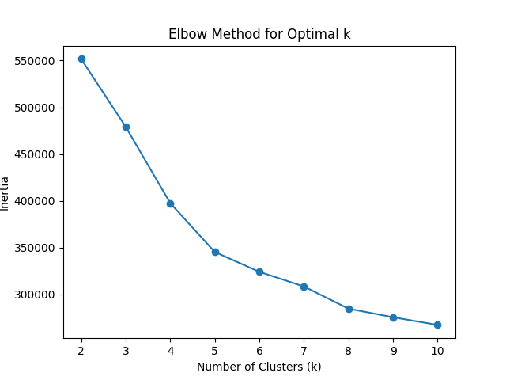
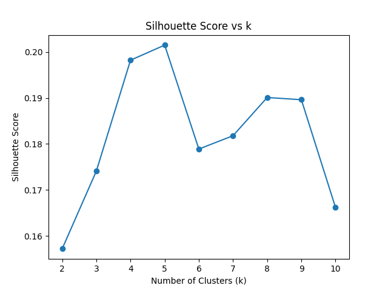
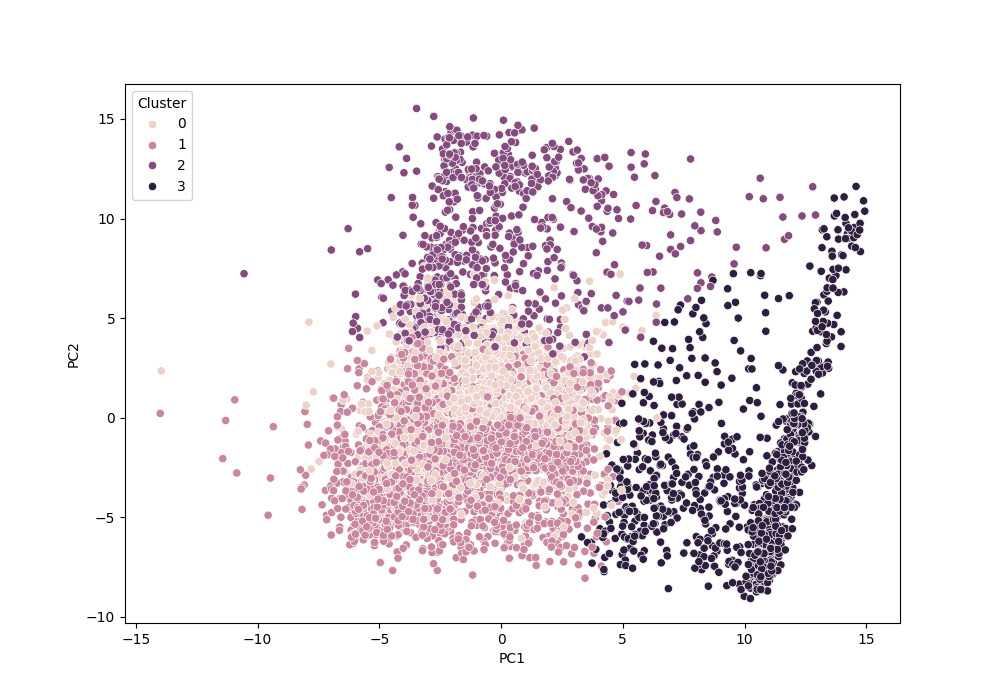

# AI-Driven Customer Intelligence System for Strategic Business Decision Making

## 1. Problem Statement

A company has collected large volumes of customer data but does not know:
- Who their most valuable customers are
- Which customers are likely to churn
- Which group spends the most
- Which group responds better to offers

There are no labels provided.

This project applies unsupervised machine learning techniques to identify meaningful customer segments and provide actionable business recommendations.

---

## 2. Dataset Description

Dataset Used: Bank Marketing Dataset  
Source: Kaggle  
Records: 5,000+ customer entries  

Features include:
- Age
- Job
- Marital Status
- Education
- Balance
- Campaign interactions
- Contact duration
- Previous contact history
- Deposit response

The dataset contains demographic, financial, and behavioral attributes required for customer segmentation.

---

## 3. Algorithms Used

The following unsupervised algorithms were implemented and compared:

- K-Means Clustering
- Hierarchical Clustering
- DBSCAN

Cluster optimization was performed using:
- Elbow Method
- Silhouette Score
- Davies-Bouldin Index

---

## 4. How to Run the Project

Step 1: Install dependencies
     pip install -r requirements.txt

Step 2: Run the main pipeline
    python main.py

The script will:
- Load dataset
- Perform preprocessing
- Train clustering model
- Print Silhouette score
- Save final clustered output

---

## 5. Key Results

- Optimal number of clusters found: 4
- Best performing algorithm: K-Means
- Silhouette Score: ~0.11

Business Insights:

- Identified high-value customer segment
- Detected at-risk customer group
- Found high-contact low-conversion segment
- Provided marketing strategy recommendations per cluster

---

## 6. Sample Visualizations

Below are sample outputs generated during the project:

1. Elbow Method Plot  
2. Silhouette Score Plot  
3. PCA Cluster Visualization  

### Elbow Method Plot

### Silhouette Score Plot

### PCA Cluster Visualization

